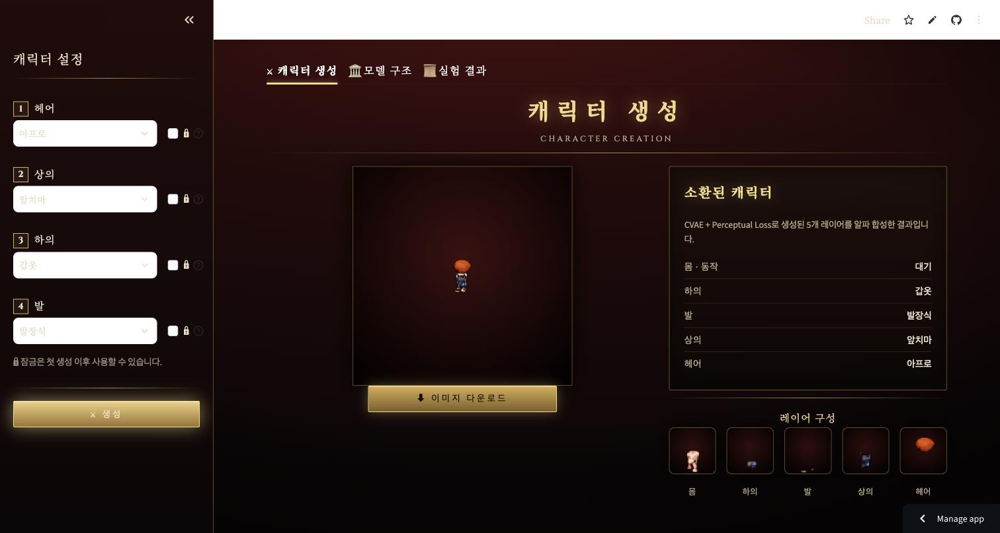
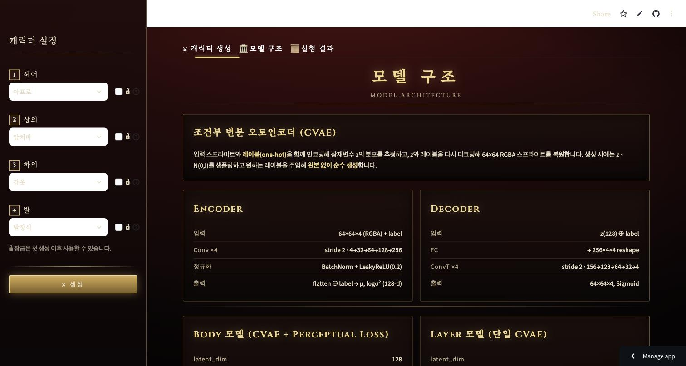
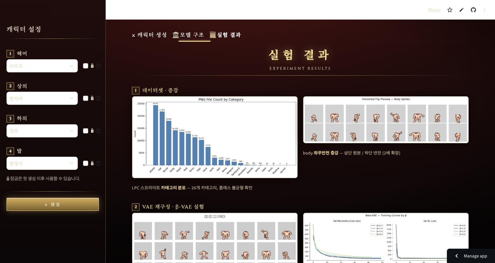
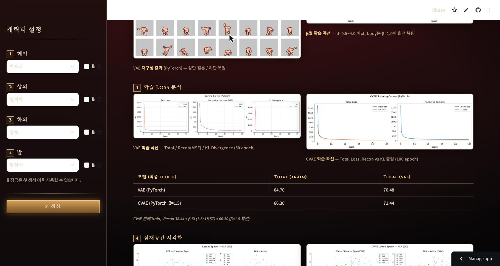
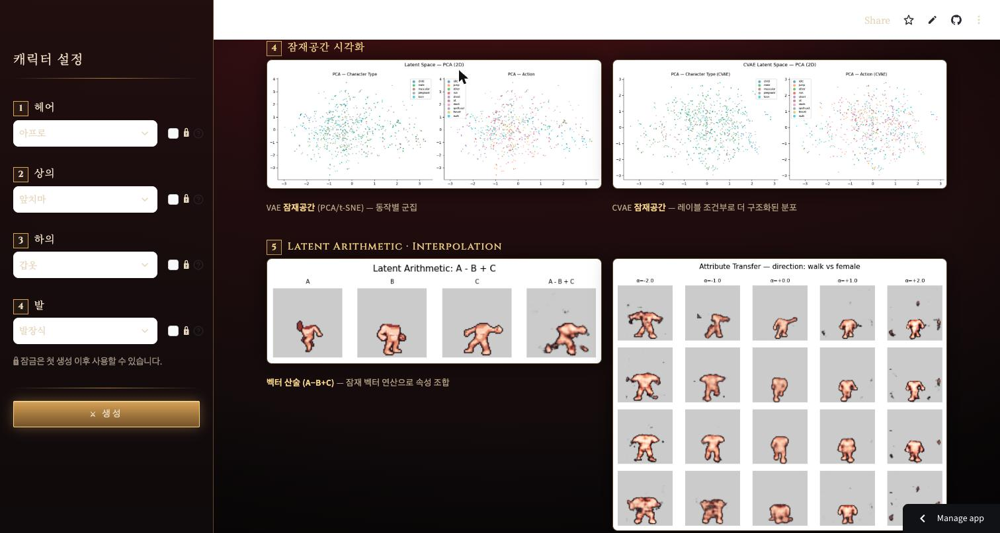
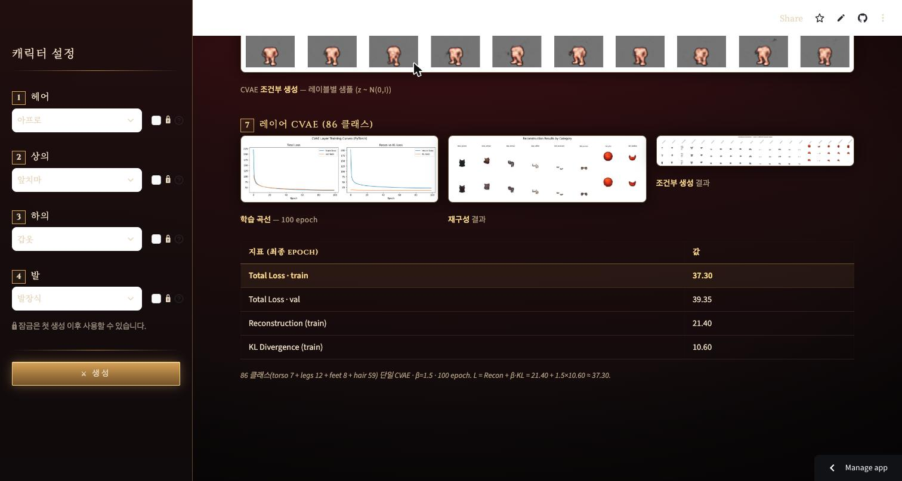

# LPC Sprite VAE

LPC(Liberated Pixel Cup) 64×64 RGBA 스프라이트 프레임을 학습하는 VAE 기반 이미지 생성 프로젝트.

**데모: https://lpcsprite.streamlit.app/**

## 노트북 실행 순서

| 번호 | 파일 | 역할 |
|------|------|------|
| 01 | `01_dataset_analysis.ipynb` | 원본 데이터셋 탐색 및 통계 |
| 02 | `02_preprocessing.ipynb` | 전처리 및 64×64 PNG 변환 |
| 03 | `03_data_restructure.ipynb` | 카테고리 재분류 (wings/tail 분리, zombie/skeleton 삭제 등) |
| 03-1 | `03-1_augment_body.ipynb` | body 데이터 좌우반전 증강 (2,272 → 4,544장) |
| 03-2 | `03-2_keyword_split.ipynb` | 카테고리 내 파일을 첫 키워드 서브폴더로 분리 (body 제외) |
| 04 | `04_vae_model_tf.ipynb` | VAE 학습 — TensorFlow |
| 04-1 | `04-1_vae_model_pytorch.ipynb` | VAE 학습 — PyTorch |
| 05 | `05_beta_vae_experiment.ipynb` | β-VAE 실험 (β=0.5/1.0/2.0/4.0 비교, β=1.0 최종 선택) |
| 06 | `06_latent_arithmetic_tf.ipynb` | Latent space arithmetic — TensorFlow |
| 06-1 | `06-1_latent_arithmetic_pytorch.ipynb` | Latent space arithmetic — PyTorch |
| 07 | `07_latent_visualization.ipynb` | VAE 잠재 공간 시각화 (PCA / t-SNE / UMAP) |
| 07-1 | `07-1_latent_visualization_cvae.ipynb` | CVAE 잠재 공간 시각화 (VAE와 비교) |
| 08 | `08_cvae_tf.ipynb` | CVAE 학습 — TensorFlow (β=1.0) |
| 08-1 | `08-1_cvae_pytorch.ipynb` | CVAE 학습 — PyTorch (β=1.5) |
| 09 | `09_cvae_perceptual_tf.ipynb` | CVAE + Perceptual Loss 파인튜닝 — TensorFlow |
| 09-1 | `09-1_cvae_perceptual_pytorch.ipynb` | CVAE + Perceptual Loss 파인튜닝 — PyTorch **★ body 모델** |
| 10 | `10_cvae_layer_pytorch.ipynb` | 레이어 CVAE 학습 — torso/legs/feet/hair (86 클래스) **★ 레이어 모델** |
| 11 | `11_cvae_pl_idle_pytorch.ipynb` | idle 프레임 전용 CVAE + Perceptual Loss (body 포함 89 클래스) |
| 12 | `12_cvae_action_pytorch.ipynb` | 액션 포함 레이블 CVAE (`{category}_{keyword}_{action}`, ~971 클래스) |
| 12-1 | `12-1_cvae_action_colab.ipynb` | 노트북 12의 Colab GPU 버전 (Drive 체크포인트 저장) |

> 데이터 준비: 03 → 03-1 → 03-2 순서로 실행 후 04 진행

## Streamlit 앱

배포: https://lpcsprite.streamlit.app/ · 로컬 실행:

```bash
streamlit run streamlit_sprite.py
```

| 선택 항목 | 모델 | 체크포인트 |
|----------|------|-----------|
| 몸 | CVAE + PL (동작 `idle` 고정) | `checkpoints_cvae_pl_pt/` |
| 헤어 / 상의 / 하의 / 발 | CVAE Layer | `checkpoints_cvae_layer_pt/` |

키워드를 조합해 5개 레이어를 각각 CVAE로 생성한 뒤 alpha composite로 합성.
몸 동작은 포즈가 흔들리지 않도록 `idle`로 고정되어 있고, 사용자는 나머지 4개 레이어만 선택한다.

앱은 **캐릭터 생성 / 모델 구조 / 실험 결과** 3개 탭으로 구성된다.
아래 스크린샷은 배포 사이트에서 직접 촬영한 화면이다.

### 1. 캐릭터 생성



- 좌측 사이드바에서 헤어 / 상의 / 하의 / 발 키워드를 선택하고 **생성** 클릭
- 중앙에 합성된 캐릭터, 우측에 선택 요약(`소환된 캐릭터`)과 레이어별 생성 결과(`레이어 구성`) 표시
- **레이어별 잠금** — 체크한 레이어는 재생성 시 이전 이미지를 그대로 유지 (첫 생성 이후 활성화)
- **이미지 다운로드** — 합성 결과를 PNG로 저장

### 2. 모델 구조



CVAE의 인코더/디코더 텐서 흐름과 두 모델(body용 CVAE + Perceptual Loss, 레이어용 단일 CVAE)의
하이퍼파라미터를 나란히 보여준다.

### 3. 실험 결과

`app_assets/experiments/`에 저장된 노트북 산출 figure를 7개 섹션으로 정리한 탭.

| 섹션 | 내용 |
|------|------|
| 1 데이터셋 · 증강 | 26개 카테고리 분포, body 좌우반전 증강 프리뷰 |
| 2 VAE 재구성 · β-VAE | 재구성 비교, β=0.5~4.0 학습 곡선 |
| 3 학습 Loss 분석 | VAE / CVAE 학습 곡선 + Total·Recon·KL 지표 표 |
| 4 잠재공간 시각화 | VAE vs CVAE의 PCA 분포 비교 |
| 5 Latent Arithmetic | A−B+C 벡터 산술, 속성 전이(interpolation) |
| 6 CVAE 조건부 생성 | 레이블별 z~N(0,I) 샘플 |
| 7 레이어 CVAE (86 클래스) | 학습 곡선 · 재구성 · 조건부 생성 + 최종 Loss 표 |









## 데이터셋 구조

```
dataset/
└── processed/          # 카테고리별 64×64 RGBA PNG
    ├── body/           # 4,544 (flat, 좌우반전 포함)
    ├── torso/
    │   ├── clothes/    # 가장 큰 서브셋
    │   ├── armour/
    │   └── ...         # chainmail, jacket, bandage, aprons, waist
    ├── legs/           # pants, skirts, armour, hose, leggings ...
    ├── feet/           # boots, shoes, sandals, socks ...
    ├── hair/           # long, afro, braid, ponytail ... (59 종)
    ├── hat/            # cloth, helmet, formal, headband ...
    ├── wings/          # 100,264 (단일 키워드, flat)
    ├── tail/           # 93,590 (단일 키워드, flat)
    └── ...             # 총 26개 카테고리
```

총 프레임 수: 약 2,848,904장

## 체크포인트 구조

```
checkpoints_tf/             # TF VAE (β=1.0)
checkpoints_pt/             # PyTorch VAE (β=1.0)
checkpoints_beta/           # β-VAE 실험 결과
checkpoints_cvae_tf/        # TF CVAE (β=1.0)
checkpoints_cvae_pt/        # PyTorch CVAE (β=1.5)
checkpoints_cvae_pl_tf/     # TF CVAE + Perceptual Loss
checkpoints_cvae_pl_pt/     # PyTorch CVAE + Perceptual Loss ★ body 생성
checkpoints_cvae_layer_pt/  # PyTorch CVAE Layer (86 클래스) ★ 레이어 생성 (git 추적)
checkpoints_cvae_pl_idle_pt/# idle 전용 CVAE + PL (89 클래스, git 추적)
checkpoints_cvae_action_pt/ # 액션 포함 레이블 CVAE (~971 클래스)
```

> git 추적: `checkpoints_cvae_pl_pt/`, `checkpoints_cvae_layer_pt/`, `checkpoints_cvae_pl_idle_pt/`.
> 나머지는 로컬에서 각 노트북을 실행해 생성하세요.

## 환경

- Python 3.10+
- TensorFlow 2.16+ (Metal GPU — Apple M1/M2)
- PyTorch 2.x (MPS 백엔드)
- scikit-learn (PCA, t-SNE)
- umap-learn (UMAP 시각화, 선택)
- Pillow, NumPy, Matplotlib

## 주요 하이퍼파라미터

| 파라미터 | VAE | CVAE | CVAE + PL | CVAE + PL (idle) |
|----------|-----|------|-----------|------------------|
| latent_dim | 128 | 128 | 128 | 128 |
| base_channels | 32 | 32 | 32 | 32 |
| epochs | 50 | 100 | 50 (파인튜닝) | 100 |
| batch_size | 64 | 128 | 128 | 128 |
| learning_rate | 1e-3 | 1e-3 | 1e-4 | 1e-3 |
| beta | 1.0 | 1.5 (PT) | 1.5 (PT) | 1.5 |
| lambda_perc | — | — | 1.0 | 1.0 |

## 문서

```
docs/
├── architecture.md              # VAE/CVAE 구조 설명
├── experiment_log.md            # 실험 기록
├── presentation_script.md       # 발표 스크립트
├── report_slides.html / .pptx   # 결과 보고 슬라이드
├── llm_project_summary.md       # LLM 연계 확장 요약 (계획 단계)
├── llm_extension_plan.md        # 자연어 → 캐릭터 생성 계획서
├── images/                      # 노트북 산출 figure
│   └── app/                     # 배포 앱 스크린샷 (README용)
└── superpowers/plans/           # 캐릭터 벡터 DB · 자연어 생성 상세 계획
```

> LLM 연계(자연어 입력 → 키워드 JSON → CVAE 생성, 캐릭터 벡터 DB)는 계획 수립까지 완료된 상태이며,
> 구현은 별도 레포(`../vae-llm`)에서 진행한다.
